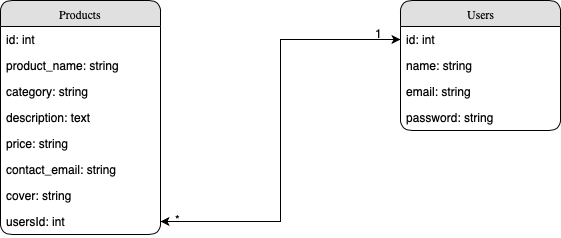

# Ruby on Rails CRUD with Native Auth

#### Build Docker Image:
```
docker compose build
```

#### Running Docker Container:

```
docker compose up
```

#### Create Database & database migrate:

```
docker exec rails bash -c 'rails db:create && rails db:migrate'
```
#### DB Config:

```
host: localhost/db(within docker)
username: postgres
database: myapp_development
password: password
port: 5432
```

#### Feature:
* User can regiser/login/logout
* User can see product listing (all/single)
* User can add/edit/delete product
* User can generate mass (10) product listing
* User delete all product listing
* User can search product from product listing

#### DB ERD Diagram:
